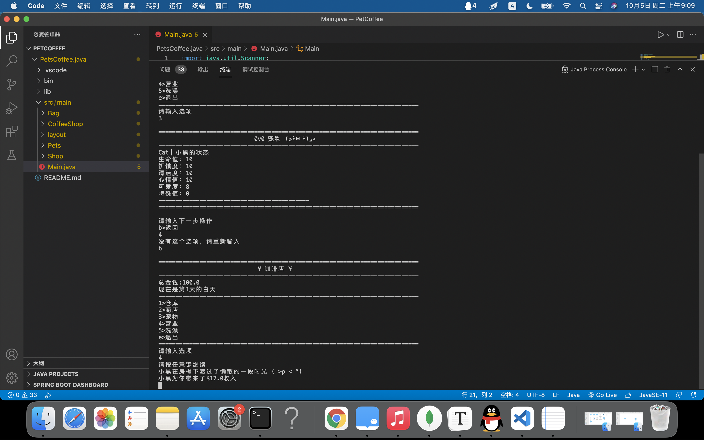

# PetCoffeeShop

#### *是一个练习学到的java各种知识的作业，一个模拟经营向猫/狗咖的游戏*

## **界面：**

## **包含的功能：**

- **仓库**（一个支持增删查改的Arraylist，并且能自动将库存为0的道具删除，增加功能还实现了工厂设计）
- **商店**（通过金钱购买道具和新的宠物）
- **宠物**（能显示各个宠物的状态和属性）
- **营业**（根据宠物的状态、属性和随机事件决定金钱收入，随机事件也会让每次营业有小小的差异；实现了基础的线程操作，让每次的宠物活动非顺序进行）
- **洗澡**（如果宠物清洁度不满，恢复满宠物的清洁度并减少心情；如果清洁度满，则宠物会逃走；实现了基础的线程操作，让每次的宠物活动非顺序进行）
- **时间**（每次营业和洗澡会增加时间，一天具有上午和下午两个时间；当一天结束时会自动调用  **吃饭**   ：该功能每个宠物每天会消耗仓库中的一份食物，根据情况会增/减 *饱食度*、*心情*  ）
- 存档
- 读档

## 日志：

#### 	版本v 0.3.0

- 实现了保存/读取功能
- 优化了背包功能的构造方法*（增加了Goods.Keys类）*
- 新增开始游戏界面（选择读档或是新开游戏）

#### 	版本v 0.2.1

- 为Worker类,main类代码进行了优化

#### 	版本v 0.2

- **从vsc换成了idea**

- 将吃，洗，工作类重新分到action包
- 实现了宠物按照可爱度排序功能
- 简化了一部分代码